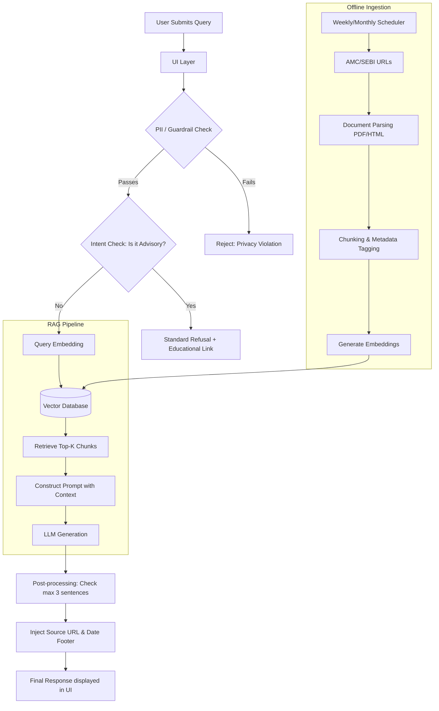

# Architecture & Phase-Wise Implementation: Mutual Fund FAQ Assistant

## 1. System Architecture Overview
The system follows a lightweight **Retrieval-Augmented Generation (RAG)** architecture designed to prioritize accuracy, traceability, and strict compliance over open-ended intelligence. 

The architecture consists of four main layers that will be implemented across four phases:
1. **User Interface (UI)**
2. **Input Guardrails & Pre-processing**
3. **RAG Pipeline (Retrieval & Generation)**
4. **Post-processing & Compliance Formatting**

---

## 2. Phase-Wise Implementation Plan

### Phase 1: Data Foundation & Ingestion (Offline Pipeline)
**Goal:** Establish the knowledge base using strictly official sources.
*   **Source Selection:** Finalize 1 AMC and 3-5 schemes across categories (e.g., large-cap, flexi-cap, ELSS).
*   **Data Collection:** Gather 15–25 official URLs (Factsheets, KIM, SID, AMC FAQs).
*   **Document Parsing:** Build parsers using `pdfplumber` for PDFs and `BeautifulSoup` for HTML.
*   **Chunking & Metadata:** Split documents into manageable chunks (e.g., 500 tokens). Tag each chunk with its exact `Source URL` and `Last Updated Date`.
*   **Vector Database:** Generate embeddings (using e.g. OpenAI `text-embedding-3-small` or local `bge-m3`) and store them in a vector database like ChromaDB or Pinecone.
*   **Automated Scheduler:** Implement a recurring job (e.g., via Python `APScheduler`) to re-run the ingestion pipeline weekly or monthly, ensuring the Vector DB stays updated with the latest AMC factsheets.

### Phase 2: Core RAG Pipeline (Online Retrieval & Generation)
**Goal:** Enable basic factual Q&A based solely on the ingested data.
*   **Retrieval Engine:** Build the logic to embed a user query, search the vector database, and retrieve the top-K most relevant chunks.
*   **LLM Integration:** Connect an LLM (e.g., GPT-4o-mini, Claude 3.5 Haiku) for generation.
*   **Prompt Engineering:** Develop a strict system prompt instructing the LLM to:
    *   Answer *only* using provided context.
    *   Keep the answer strictly under 3 sentences.
    *   Include exactly one citation link from the context.

### Phase 3: Guardrails, Refusal & Post-Processing Layer
**Goal:** Enforce safety, compliance, and strict factual boundaries.
*   **PII Filter (Pre-processing):** Implement regex patterns to block queries containing PAN, Aadhaar, account numbers, or OTPs.
*   **Intent Classifier (Pre-processing):** Detect subjective or advisory queries (e.g., "Which is better?"). If detected, bypass RAG and return a standard refusal template with an AMFI/SEBI educational link.
*   **Post-processing Formatting:** 
    *   Programmatically enforce the 3-sentence limit (truncate or regenerate if failed).
    *   Inject the standard footer: `“Last updated from sources: <date>”` directly from the metadata.
*   **Performance Query Fallback:** If the query asks for return percentages, output a strict template directing the user to the official factsheet link instead of calculating or summarizing performance.

### Phase 4: User Interface & End-to-End Integration
**Goal:** Provide a minimal, clean interface and connect all components.
*   **Frontend Development:** Build a lightweight UI using Streamlit, Gradio, or FastAPI + simple HTML/JS.
*   **UI Elements:** 
    *   Welcome message and 3 example questions.
    *   Query input box and clean response display.
    *   Permanent static disclaimer: `“Facts-only. No investment advice.”`
*   **System Integration:** Wire the UI to the Guardrails -> RAG Pipeline -> Post-Processing.
*   **Testing & Polish:** Run success criteria testing (accurate retrieval, strict refusal of advisory queries, citations presence).

---

## 3. Data Flow Diagram

---

## 4. Proposed Technology Stack
*   **Frontend**: Streamlit (fast prototyping) or simple Next.js/React.
*   **Backend Framework**: FastAPI (Python).
*   **Orchestration**: LangChain or LlamaIndex.
*   **Embedding Model**: OpenAI `text-embedding-3-small` or BAAI `bge-m3`.
*   **LLM**: OpenAI GPT-4o-mini or Anthropic Claude 3.5 Haiku.
*   **Vector Database**: ChromaDB (local) or Pinecone (cloud).
*   **Parsers**: `pdfplumber` (SIDs/Factsheets), `BeautifulSoup` (HTML FAQs).
